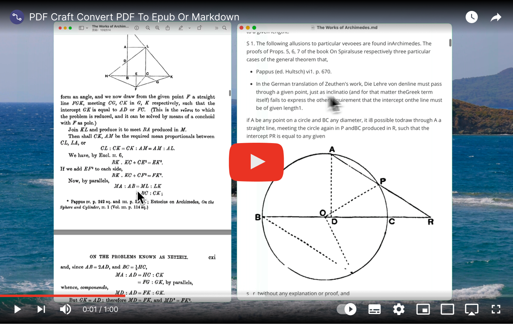

  <h1>PDF Craft</h1>
  

    
  

  

An [OOMOL](https://hub.oomol.com/) Package that provides visual Blocks for using the [pdf-craft](https://github.com/oomol-lab/pdf-craft) project.

## Introduction

PDF Craft can convert PDF files into various other formats. This project will focus on processing PDF files of scanned books. If you encounter any problems or have any suggestions, please submit [issues](https://github.com/oomol-lab/pdf-craft/issues).

This project can read PDF pages one by one, and use [DocLayout-YOLO](https://github.com/opendatalab/DocLayout-YOLO) mixed with an algorithm I wrote to extract the text from the book pages and filter out elements such as headers, footers, footnotes, and page numbers. In the process of crossing pages, the algorithm will be used to properly handle the problem of the connection between the previous and next pages, and finally generate semantically coherent text. The book pages will use [OnnxOCR](https://github.com/jingsongliujing/OnnxOCR) for text recognition. And use [layoutreader](https://github.com/ppaanngggg/layoutreader) to determine the reading order that conforms to human habits.

With only these AI models that can be executed locally (using local graphics devices to accelerate), PDF files can be converted to Markdown format. This is suitable for papers or small books.

However, if you want to parse books (generally more than 100 pages), it is recommended to convert them to [EPUB](https://en.wikipedia.org/wiki/EPUB) format files. During the conversion process, this library will pass the data recognized by the local OCR to [LLM](https://en.wikipedia.org/wiki/Large_language_model), and build the structure of the book through specific information (such as the table of contents, etc.), and finally generate an EPUB file with a table of contents and chapters. During this parsing and building process, the comments and reference information of each page will be read through LLM, and then presented in a new format in the EPUB file. In addition, LLM can correct OCR errors to a certain extent. This step cannot be performed entirely locally. You need to configure the LLM service. It is recommended to use [DeepSeek](https://www.deepseek.com/). The prompt of this library is based on the V3 model debugging.
